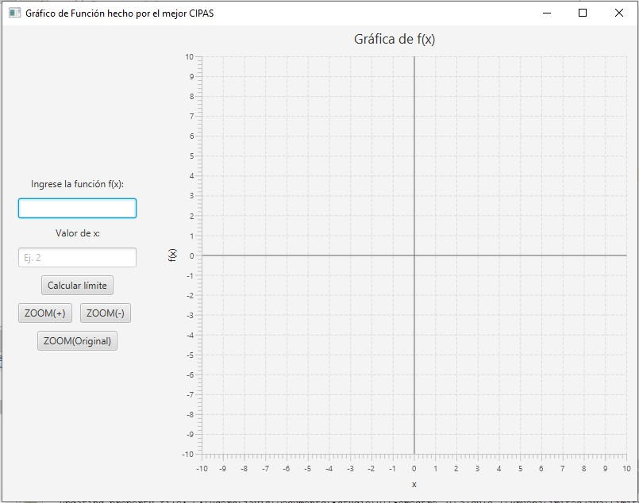
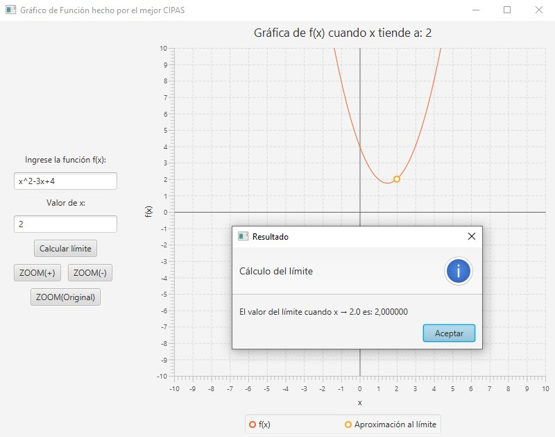

# Calculadora de Límites en JavaFX

Este proyecto es una aplicación desarrollada en JavaFX que permite calcular y visualizar el límite de una función matemática en un punto específico. Utiliza la librería [mXparser](http://mathparser.org/) para evaluar expresiones matemáticas de forma precisa y flexible.

## Características

- Entrada de funciones matemáticas en notación estándar (ej. `x^2 - 3x + 2`)
- Evaluación del límite aproximado por la izquierda y derecha
- Detección de límites definidos, indefinidos o que no existen
- Visualización gráfica de la función
- Funciones de zoom (+), zoom (-) y reset de zoom
- Movimiento del gráfico con el mouse (drag and move)
- Manejo de funciones ingresadas con letras en mayúsculas o minúsculas

## Tecnologías usadas

- Java 11+
- JavaFX
- mXparser

## Cómo ejecutar

1. Clona el repositorio:
    ```bash
    git clone https://github.com/Javieeer/appLimitesJava
    cd appLimitesJava
    ```

2. Asegúrate de tener configurado JavaFX y mXparser en tu proyecto. Puedes descargar mXparser desde:  
   [https://mathparser.org/mxparser-downloads/](https://mathparser.org/mxparser-downloads/)\
   Allí baja hasta ver la opción de descarga "Download latest release – v.6.1.0 Sagitara: JAVA bin only"\
   Asegurate de tener las librerías necesarias descargadas e importadas en el proyecto
   

3. Ejecuta la aplicación desde tu IDE 

## Capturas de pantalla




## Autor

Desarrollado por el mejor CIPAS 😉  
Javier Zapata  
GitHub: [@Javieeer](https://github.com/Javieeer)

---